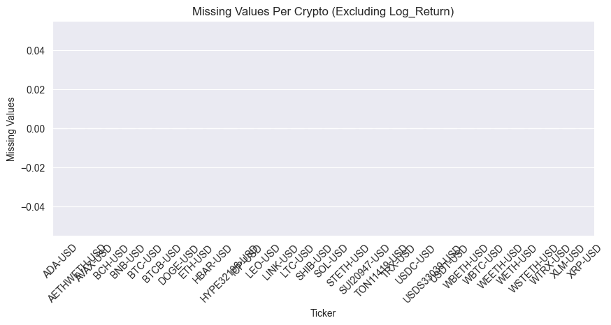

# CryptoViz: Interactive Crypto Return Analysis and Prediction Tool

Interactive Crypto Return Analysis and Prediction Tool for STATS 418 FInal Project

**Live Demo:** [CryptoViz Shiny App](https://cryptoviz-shiny-349535554801.us-central1.run.app/)

## Overview

CryptoViz is a full-stack web application designed to provide users with tools for analyzing cryptocurrency market data. It offers interactive visualizations of historical price trends, correlation analysis between different cryptocurrencies, and short-term price forecasting using ARIMA time series models. The project aims to make complex crypto data more accessible and understandable for enthusiasts and potential investors.

The application features a two-part data pipeline for acquiring and updating market data, a Flask backend API serving ARIMA model predictions, and an interactive frontend dashboard built with Shiny for Python. The entire application is containerized using Docker and deployed on Google Cloud Run for online accessibility.

## Features

* **Dynamic Ticker List:** Automatically scrapes Yahoo Finance to get a list of top cryptocurrencies by market capitalization.
* **Comprehensive Data Acquisition:** Downloads daily OHLC (Open, High, Low, Close) price data and trading volume using the `yfinance` library. Includes intelligent updates for existing data and calculation of log returns.
* **Interactive Price Visualization:** Users can select a cryptocurrency and view its historical close prices' trend on an interactive Plotly chart.
* **ARIMA Time Series Forecasting:**
    * Generates one-step-ahead (next day) price forecasts for selected cryptocurrencies.
    * Displays the predicted price along with a 95% confidence interval.
    * Provides a comparison of the forecast with the previous day's closing price.
* **Correlation Analysis:**
    * Allows users to select multiple cryptocurrencies and a timeframe (7D, 30D, 90D).
    * Calculates and displays a correlation heatmap of daily log returns.
* **User-Driven Coin Analysis:** Users can input a new cryptocurrency ticker, and the application will fetch its data in real-time, save it, and make it available for analysis in the dashboard.
* **Containerized & Cloud-Deployed:** Fully containerized using Docker and deployed on Google Cloud Run for public access.

## Technology Stack

* **Backend:** Python, Flask (for API), Statsmodels (for ARIMA)
* **Frontend:** Python, Shiny for Python
* **Data Visualization:** Plotly (interactive charts), Plotnine (static heatmaps)
* **Data Handling:** Pandas, NumPy
* **Web Scraping:** Requests, lxml, yfinance
* **Data Storage:** JSON (for ticker list), CSV (for historical data)
* **Containerization:** Docker
* **Cloud Deployment:** Google Cloud Run, Docker Hub (for image registry)

## Project Structure

The project is organized into the following main directories:

* `/data/`: Stores the `crypto_tickers.json` file and individual `.csv` files for each cryptocurrency's historical data.
* `/scripts/`: Contains Python scripts for data acquisition:
    * `scrape_tickers.py`: Scrapes Yahoo Finance for top crypto tickers.
    * `get_data.py`: Downloads and updates historical data for tickers.
    * `data_manager.py`: A shared module for fetching and saving individual ticker data, used by both `get_data.py` and the Shiny app.
* `/backend_api/`: Houses the Flask application (`api.py`) that serves the ARIMA model predictions.
* `/shiny_app/`: Contains the Shiny for Python web application (`app.py`) for the user interface and dashboard.
* `Dockerfile`: Separate Dockerfiles are present in `/backend_api/` and `/shiny_app/` for containerizing each component.

## Data Acquisition

The data pipeline is a two-step process:

1.  **Identifying Top Cryptocurrencies (`scrape_tickers.py`):**
    * Automated web scraping of Yahoo Finance (using Python with `requests` and `lxml`) obtains a current list of the top ~30 cryptocurrencies by market capitalization.
    * This list is saved to `data/crypto_tickers.json` and dynamically guides the subsequent data download process.
    * **

2.  **Fetching Historical Market Data (`get_data.py` & `data_manager.py`):**
    * The `yfinance` Python package is used to download historical daily data for each ticker found in `crypto_tickers.json`.
    * **Data Includes (Daily):** Open, High, Low, Close (OHLC) prices, and Volume.
    * **Timeframe:** Data is collected from January 1, 2022, to the present.
    * **Intelligent Updates:** Full historical download for new coins; incremental updates (refreshing the last known day and appending new data) for existing coins.
    * **Derived Metric:** Log Returns (`log(Close_t / Close_t-1)`) are calculated and stored, as they are essential for statistical analysis and modeling.
    * Data for each coin is saved as an individual `.csv` file in the `/data/` directory.
    * **

The system also supports fetching data for new tickers entered by the user directly in the Shiny app, which are then saved as `.csv` files and added to the master `crypto_tickers.json` list.

## Exploratory Data Analysis (EDA)

EDA was performed to understand the characteristics of the cryptocurrency data and inform design choices for the application.

* **Missing Values:** An initial check for missing values was performed. For most major cryptocurrencies, daily data from Yahoo Finance is quite complete. The `Log_Return` will have one missing value at the beginning for each series due to the nature of its calculation.

    


* **Price and Volume Trends:** Visualizing historical prices and volumes helps identify major market trends, bull/bear cycles, and periods of high activity.

    
    *Figure: Bitcoin Close and Open Prices Over Time, showing significant volatility and trend changes.*

    
    *Figure: Bitcoin Trading Volume Over Time, often correlating with major price movements.*

* **Correlation Analysis:** An essential aspect of understanding the cryptocurrency market is recognizing that while assets can be influenced by broader trends, they don't all move in perfect lockstep. Our Exploratory Data Analysis confirmed the existence of varying degrees of correlation between the daily log returns of different cryptocurrencies. This observation underscores the value of the CryptoViz correlation panel, as it allows users to visually explore these diverse relationships and identify how closely (or loosely) different assets are connected, which is a key insight for any market participant.
    
    *Figure: Correlation heatmap of daily close price for the top 10 cryptocurrencies over a selected period. This visualization is interactive in the live application.*
    Insights from EDA, such as the time-series nature of prices and the dynamic correlations, directly influenced the features developed in the CryptoViz dashboard.

## Modeling: ARIMA Time Series Forecasting

To provide short-term price predictions, an ARIMA (Autoregressive Integrated Moving Average) model was implemented.

* **Why ARIMA?**
    * It's a well-established statistical model for univariate time series forecasting.
    * It effectively captures dependencies on past values (autoregression) and past forecast errors (moving average).
    * It can handle non-stationary data (common in financial prices) through differencing.

* **ARIMA (p, d, q) Parameters:**
    * **p:** Autoregressive order (number of lag observations).
    * **d:** Degree of differencing (to achieve stationarity). For financial price series, `d=1` is common.
    * **q:** Moving Average order (number of lagged forecast errors).

* **Parameter Selection:**
    * Initially, a common heuristic like ARIMA(5,1,0) was used.
    * To optimize parameters for a specific series like BTC-USD, the Akaike Information Criterion (AIC) was used. AIC helps select the model that best fits the data while penalizing for an excessive number of parameters.
    * Based on AIC evaluation, the ARIMA order for BTC-USD was updated to **ARIMA(4,1,5)**, as this combination yielded a lower AIC value, suggesting a better trade-off between model fit and complexity.
        
        *Figure: AIC values for different ARIMA(p,d,q) orders for BTC-USD, with (4,1,5) showing a favorable (lower) AIC.*
    * To save calculation time for the API, the default model for all cryptoes are set to be **ARIMA(4,1,5)**.

* **Implementation:**
    * The model is trained on the historical daily 'Close' prices.
    * It generates a one-step-ahead forecast (next day's price) with a 95% confidence interval.
    * This forecasting logic is encapsulated in a Flask API (`/backend_api/api.py`) for easy access by the frontend.

## Application Dashboard

The CryptoViz dashboard is an interactive web application built with Shiny for Python.

* **Forecasting Panel:**
    * Users select a cryptocurrency from a dynamically updated dropdown.
    * An interactive Plotly chart displays historical close prices.
    * A "Generate Forecast" button calls the backend API.
    * The forecast (point estimate and confidence interval) is overlaid on the chart.
    * A textual summary indicates if the prediction is higher or lower than the previous day's close, with the percentage change.
* **User-Driven Analysis:**
    * An input field allows users to add new tickers not currently in the list.
    * The app fetches data for the new ticker in real-time, saves it, updates `crypto_tickers.json`, and refreshes the dropdowns.
    
* **Correlation Analysis Panel:**
    * Users can select multiple cryptocurrencies.
    * Users choose a timeframe (7D, 30D, 90D).
    * A heatmap (using Plotnine, rendered as a static image for now) displays the log return correlations.
    


## Deployment

The CryptoViz application is deployed on Google Cloud Run for online accessibility.

1.  **Containerization:**
    * The Flask API and the Shiny Web App are containerized separately using Docker.
    * Each has its own `Dockerfile` and `requirements.txt`.
2.  **Image Registry:**
    * The built Docker images (`cryptoviz-api` and `cryptoviz-shiny`) were pushed to Docker Hub.
    * Images were built for the `linux/amd64` platform to ensure compatibility with Cloud Run.
3.  **Google Cloud Run Deployment:**
    * The `cryptoviz-api` service was deployed, exposing port 5000.
    * The `cryptoviz-shiny` service was deployed, exposing port 8000.
    * An environment variable (`API_URL`) was set for the Shiny service to point to the public URL of the deployed API service, enabling communication between the frontend and backend.
    * Both services are configured to allow unauthenticated access for this demonstration.

**Live Application URL:** [https://cryptoviz-shiny-349535554801.us-central1.run.app/](https://cryptoviz-shiny-349535554801.us-central1.run.app/)

## Getting Started (Local Setup)

### Prerequisites

* Python 3.9+
* pip (Python package installer)
* Docker Desktop (if running with Docker)
* Virtual environment tool (e.g., `venv`)

### Setup Instructions

1.  **Clone the repository:**
    ```bash
    git clone <https://github.com/2achAreeee/CryptoViz.git>
    cd CryptoViz
    ```

2.  **Create and activate a virtual environment:**
    ```bash
    python -m venv venv
    source venv/bin/activate  # On Windows: venv\Scripts\activate
    ```

3.  **Install dependencies:**
    * For the backend API (navigate to `/backend_api`):
        ```bash
        pip install -r requirements.txt
        ```
    * For the Shiny app (navigate to `/shiny_app`):
        ```bash
        pip install -r requirements.txt
        ```
    * (Alternatively, if you have a root `requirements.txt` or `pyproject.toml` for the whole project, install from there).

### Running Locally (With Docker)

1.  **Build the Docker images:**
    * API: `cd backend_api && docker build -t cryptoviz-api .`
    * Shiny: `cd shiny_app && docker build -t cryptoviz-shiny .` (Ensure Dockerfile paths are correct if building from within the subdirectories, or build from root specifying Dockerfile path).
      ```bash
      # From project root (CryptoViz/)
      docker build -t cryptoviz-api -f backend_api/Dockerfile .
      docker build -t cryptoviz-shiny -f shiny_app/Dockerfile .
      ```

2.  **Create a Docker network:**
    ```bash
    docker network create cryptoviz-net
    ```

3.  **Run the containers:**
    * API:
        ```bash
        docker run --rm --name cryptoviz-api-container --network cryptoviz-net -p 5001:5000 cryptoviz-api
        ```
    * Shiny App (ensure `API_URL` in `app.py` is `http://cryptoviz-api-container:5000/forecast` for this setup):
        ```bash
        docker run --rm --name cryptoviz-shiny-container --network cryptoviz-net -p 8000:8000 cryptoviz-shiny
        ```
    * Access the app at `http://localhost:8000`.

## Future Enhancements

* **Advanced Forecasting Models:** Explore and integrate models like Prophet, LSTMs, or GARCH for potentially more accurate or nuanced forecasts.
* **Automated ARIMA Parameter Selection:** Implement AIC/BIC-based selection for (p,d,q) parameters for each coin.
* **User Authentication & Personalization:** Allow users to create accounts, save preferences, and maintain watchlists.
* **Expanded EDA Tools:** Add more technical indicators, volatility plots, and statistical tests to the dashboard.
* **News Sentiment Integration:** Incorporate sentiment analysis from crypto news or social media to potentially enhance forecasting or provide market context.
* **Persistent Storage on Cloud:** For user-added tickers and other user-specific data when deployed, integrate a cloud database solution.

## Author

* **Zeyan Huang**


